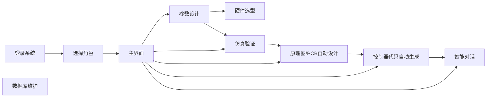

# AI+电力电子智能设计系统 🚀

<div align="center">


**从指标到硬件AI+电力电子设计系统**

[功能特性](#-功能特性) • [快速开始](#-快速开始) • [使用指南](#-使用指南) • [技术栈](#-技术栈) • [贡献指南](#-贡献指南) 

</div>

---

## 📖 项目简介

AI+电力电子智能设计平台是一个集成了人工智能算法、电力电子仿真和自动化设计的综合性Web应用平台。该平台致力于通过AI技术优化Buck变换器等电力电子设备的设计流程，实现从参数优化、仿真验证到PCB设计的全自动化工作流。

### 🎯 核心价值

- **智能优化**：采用PPO强化学习算法自动优化电路参数，提升设计效率
- **仿真验证**：集成MATLAB/Simulink环境，实时验证设计性能
- **自动化设计**：从原理图到PCB布局的自动生成与优化
- **智能交互**：基于大语言模型的技术咨询与问题解答
- **远程协作**：支持公网访问和远程桌面控制，便于团队协作

### 🌟 应用场景

- 电力电子工程师的参数设计与优化
- 教学科研中的电路仿真与实验
- 企业级电力电子产品开发
- 自动化PCB设计与制造

---

## ✨ 功能特性

### 1. 🎛️ 参数智能设计

- 基于**PPO（Proximal Policy Optimization）强化学习算法**自动优化Buck变换器参数
- 支持多目标优化：效率、纹波、动态响应等
- 实时显示训练进度和性能曲线
- 自动保存最优参数配置

### 2. 🔬 仿真验证

- 无缝集成**MATLAB/Simulink**仿真环境
- 支持自定义参数仿真和优化参数验证
- 实时流式输出仿真日志
- 自动生成性能分析报告和波形图

### 3. 🔌 原理图/PCB自动设计

- 基于设计参数自动生成原理图
- 智能器件选型与推荐
- PCB布局布线初步方案生成
- 集成KiCad等EDA工具支持

### 4. 💻 控制器代码生成

- 自动生成嵌入式控制器代码模板
- 支持多种微控制器平台（STM32、TI DSP等）
- Simulink控制逻辑自动转换
- 代码优化与注释生成

### 5. 💬 智能对话助手

- 集成大语言模型提供技术咨询
- 电力电子专业知识问答
- 设计建议与故障诊断
- 实时对话交互

### 6. 🗄️ 数据库管理

- 可视化数据库操作界面
- 支持CSV文件导入导出
- 历史设计方案管理
- 数据备份与恢复

### 7. 🖥️ 远程桌面控制

- 支持远程鼠标键盘操作
- 实时屏幕共享
- 窗口管理与应用控制
- 密码保护与安全访问

### 8. 🌐 公网访问支持

- 支持固定域名访问
- HTTPS安全传输
- 多人同时在线协作

---

## 🚀 快速开始

### 环境要求

- **Python**: 3.8 或更高版本
- **MATLAB**: R2018b 或更高版本（需要MATLAB Engine API for Python）
- **操作系统**: Windows 10/11（支持部分远程控制功能）

### 安装步骤

#### 1. 克隆项目

```bash
git clone <repository-url>
cd "AI-based optimized design/Code/python/webapp"
```

#### 2. 安装Python依赖

```bash
pip install -r requirements.txt
```

**主要依赖包：**

```
flask>=2.0.0
waitress>=2.1.0
mss>=6.1.0
pillow>=9.0.0
pywin32>=300
openai>=1.0.0
psutil>=5.9.0
pandas>=1.3.0
pyngrok>=5.1.0
```

#### 3. 安装MATLAB Engine（可选，用于仿真功能）

```bash
# 进入MATLAB安装目录
cd "matlabroot\extern\engines\python"
python setup.py install
```

> **注意**: 将`matlabroot`替换为实际的MATLAB安装路径，例如：`C:\Program Files\MATLAB\R2024b`

#### 4. 配置环境变量（可选）

创建`.env`文件或设置系统环境变量：

```bash
# Flask配置
WEBAPP_SECRET_KEY=your-secret-key-here

# 服务器配置
HOST=0.0.0.0
PORT=5000

# Ngrok配置（公网访问）
NGROK_AUTHTOKEN=your-ngrok-token
NGROK_REGION=us  # 或 eu, ap, au, sa, jp, in

# OpenAI API（智能对话功能）
OPENAI_API_KEY=your-openai-api-key
```

#### 5. 配置密码

编辑`roles_passwords.json`设置管理员和用户密码：

```json
{
  "admin": "your-admin-password",
  "user": "your-user-password"
}
```

#### 6. 启动应用

```bash
python app.py
```

启动成功后，控制台会显示访问地址：

```
[startup] AI+电力电子 已启动 (生产服务器: waitress)
[startup] 本机访问:    http://127.0.0.1:5000
[startup] 局域网访问:  http://x.x.x.x:5000
[startup] 公网访问:    https://ai_power_electronics.aipowerelectronics.top
```

---

## 📚 使用指南

### 基本工作流程



### 1. 参数设计流程

**步骤：**

1. 在主界面点击 **"参数设计"** 卡片
2. 系统启动PPO训练算法
3. 实时查看训练进度和性能曲线
4. 等待训练完成，系统自动保存最优参数
5. 查看优化结果和性能指标

### 2. 仿真验证流程

**步骤：**

1. 点击 **"仿真验证"** 按钮
2. 选择仿真模式：
   - **优化参数仿真**：使用PPO优化的参数
   - **自定义参数仿真**：手动输入参数
3. 查看实时仿真日志
4. 等待仿真完成，下载结果报告

### 3. 原理图/PCB设计

**步骤：**

1. 点击 **"原理图/PCB自动设计"**
2. 系统根据优化参数自动选型
3. 生成原理图和PCB初稿
4. 支持手动调整和优化
5. 导出KiCad工程文件

### 4. 智能对话

**使用方式：**

- 点击 **"智能对话"** 进入AI助手界面
- 输入问题或需求，获取专业建议
- 支持多轮对话和上下文理解

### 5. 数据库管理

**功能：**

- **查看数据**：浏览历史设计方案
- **导入数据**：上传CSV文件
- **导出数据**：下载设计结果
- **数据备份**：定期备份重要数据

---

## 🛠️ 技术栈

### 后端技术

| 技术 | 版本 | 用途 |
|------|------|------|
| **Python** | 3.8+ | 核心开发语言 |
| **Flask** | 2.0+ | Web框架 |
| **Waitress** | 2.1+ | WSGI生产服务器 |
| **MATLAB Engine** | R2024b+ | 仿真引擎接口 |

### 前端技术

| 技术 | 用途 |
|------|------|
| **HTML5/CSS3** | 页面结构与样式 |
| **JavaScript (ES6+)** | 交互逻辑 |
| **Server-Sent Events** | 实时日志流 |
| **Canvas API** | 远程桌面渲染 |

### 核心算法

- **PPO (Proximal Policy Optimization)**: 强化学习参数优化
- **Multi-Task ResNet**: 神经网络模型（MT-ResNet）

### 支持工具

| 工具 | 用途 |
|------|------|
| **Ngrok** | 公网穿透 |
| **mss** | 屏幕截图 |
| **pywin32** | Windows API调用 |
| **PIL/Pillow** | 图像处理 |
| **psutil** | 进程管理 |
| **pandas** | 数据处理 |

### 系统架构

```
┌─────────────────────────────────────────────────┐
│                   用户界面层                     │
│  (HTML/CSS/JavaScript + SSE实时通信)            │
└─────────────────┬───────────────────────────────┘
                  │
┌─────────────────┴───────────────────────────────┐
│                Flask应用层                       │
│  • 路由管理 • 会话控制 • API接口                  │
└─────────────────┬───────────────────────────────┘
                  │
        ┌─────────┴─────────┐
        │                   │
┌───────┴────────┐  ┌───────┴──────┐
│  业务逻辑层     │  │   数据访问层  │
│  • PPO训练     │  │  • CSV读写    │
│  • 仿真控制     │  │  • 模型加载   │
│  • EDA自动化    │  │  • 数据管理   │
└───────┬────────┘  └───────┬───────┘
        │                   │
┌───────┴───────────────────┴────────┐
│            外部接口层               │
│  • MATLAB Engine                   │
│  • Ngrok                           │
│  • Windows API                     │
└────────────────────────────────────┘
```

---

## 🎨 界面预览

### 主界面

主界面采用卡片式设计，清晰展示各功能模块：

- **渐变色标题**：现代化视觉效果
- **悬停动画**：流畅的交互体验
- **响应式布局**：适配各种屏幕尺寸
- **状态栏**：实时显示系统状态

### 运行界面

- **实时日志流**：Server-Sent Events推送
- **进度条**：可视化任务进度
- **停止控制**：随时中断任务
- **结果展示**：自动显示输出文件

---

## 🔧 配置说明

### 1. 密码配置

**`roles_passwords.json`**: 角色密码配置

```json
{
  "admin": "管理员密码",
  "user": "普通用户密码"
}
```

### 2. 远程控制密码

**`remote_mouse_password.txt`**: 远程鼠标控制密码

```
your_password
```

### 3. Ngrok配置

设置环境变量启用公网访问：

```bash
export NGROK_AUTHTOKEN=your_token_here
export NGROK_REGION=us  # 可选: us, eu, ap, au, sa, jp, in
```

## 🤝 贡献指南

我们欢迎所有形式的贡献！无论是新功能、Bug修复、文档改进还是问题反馈。

### 贡献流程

1. **Fork项目**

```bash
git clone https://github.com/your-username/AI-based-optimized-design.git
cd AI-based-optimized-design
```

2. **创建特性分支**

```bash
git checkout -b feature/your-feature-name
```

3. **提交更改**

```bash
git add .
git commit -m "feat: 添加新功能描述"
```

4. **推送到远程**

```bash
git push origin feature/your-feature-name
```

5. **创建Pull Request**

在GitHub上创建PR，详细描述您的更改。


## 📄 License

详见 [LICENSE]文件。

**⭐ 如果这个项目对您有帮助，请给我们一个Star！⭐**

南航电力电子团队

</div>

